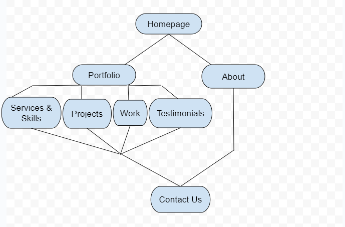

# alx_capstone_project

<H1>PERSONAL PORTFOLIO WEBSITE</H1>
Overview

A Responsive Portfolio Website Using Html, Css and JavaScript, with a beautiful user interface. It contains a Header, Home, About, Services & Skills, Portfolio, Project, Testimonial and 2 Contact Forms.

Features and Functionalities
    Categories and tags
    User profiles
    User dashboard

Technologies Used

    HTML
    CSS
    Javascript
    Git

Demo
    

    
<a href="#">Video Demo link</a>

Design

    User Interface

Future Enhancements

    Add user role management (admin).
    Implement social media sharing options for posts.

Author: Fred Eseka 
<a href="https://github.com/dricko147">Github: dricko147</a>

Contact Information 

<a href="https://twitter.com/fred_floss"> Twitter </a>

<a href="https://linkedin.com/fred_floss"> Linkedin </a>

<a href="fred.eseka@gmail.com"> email </a>
